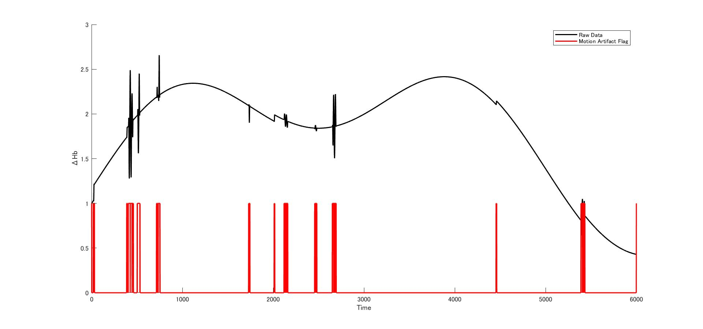
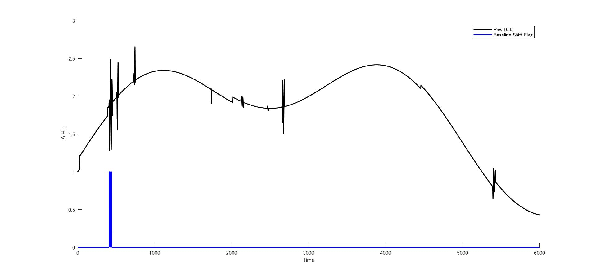
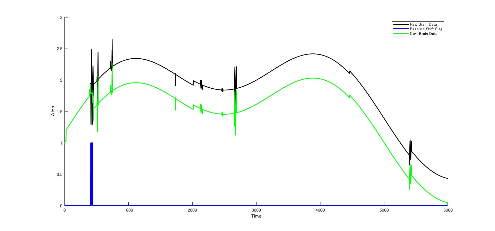

# Motion Artifact Correction Plug-in for "Open POTATo"

---

## Download
Download Plug-in from ###.

## Introduction
　Open POTATo is a platform software that integrates a variety of tools for fNIRS data analysis. Open POTATo performs the analysis by selecting the fNIRS measurement data the setting the analysis method and drawing method.  
　Motion Artifact can significantly influence the quality the recorded optical signals of fNIRS. Therefore, we have developed a plug-in that correct Motion Artifact for Open POTATo.  

## Apps
The following is a quick overview of the apps. Further documentation is available within the apps themselves.

### Example 1: Motion artifact detection by sobel filter

### Example 2: Motion artifact detection by standard deviation of heart rate variability

### Example 3: Baseline shift detection heart rate variability

### Example 4: Correction of motion artifact by spline interpolation

## References
[1] Stephanie et al. (2016), 'Thtorial on platform for optical topography analysis tools', Neurophotonics, Volume 3.  

[2] Sholkmann et al. (2010), 'How to detect and reduce movement artifacts in near-infrared imaging using moving standard deviation and spline interpolation', Physiological Measurement, Volume31, pp649-662.  
